# Session 13: Kubernetes Storage, HPA & Probes

## Task 1: Kubernetes Volumes

Here is a quick rundown of the main storage concepts I learned about in this session:

- **emptyDir**: This is a temporary storage directory created when a pod starts. It's shared among containers inside the same pod but gets completely wiped out once the pod is deleted. A practical example is using it for temporary cache or sharing files between an application container and a sidecar container before the pod shuts down.
- **hostPath**: This mounts a specific directory from the physical node directly into the pod. I learned that it's mostly used for local testing or very specific node-level tasks, rather than for permanent application storage in production. 
- **PersistentVolume (PV)**: Think of this as an actual piece of storage available in the cluster, like an independent hard drive. The important part is that its lifecycle is completely separate from any individual pod, meaning data stays safe even if the pod gets deleted.
- **PersistentVolumeClaim (PVC)**: This is basically a request for storage. When my pod needs storage, it creates a PVC to ask for a specific amount of space (like 500Mi) and access mode (like ReadWriteOnce). Kubernetes then finds a suitable PV and binds them together.
- **StorageClass**: This acts like a template that describes a specific type of storage offered in the cluster. It defines how storage should be provisioned and allows administrators to offer different tiers or types of storage easily.
- **Dynamic Provisioning**: Instead of having an admin manually create PVs in advance, dynamic provisioning uses a StorageClass to automatically create the PV on the fly right when a PVC requests it. This saves a lot of manual management.
### 01 Volumes Output
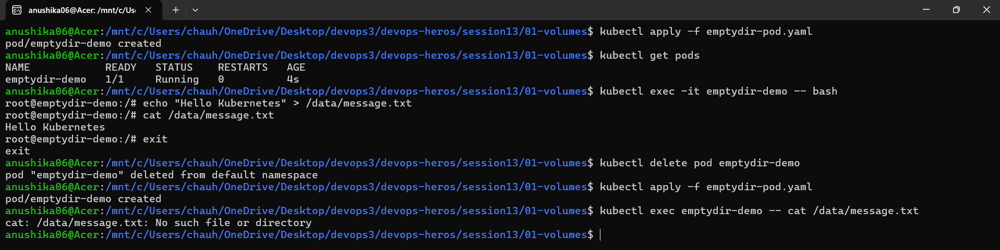

### 02 Persistent Storage Output
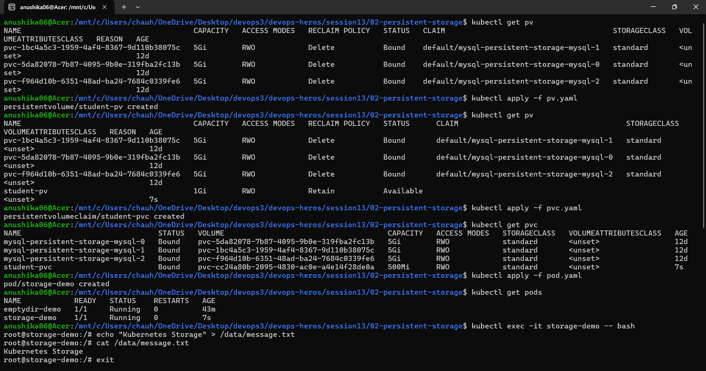
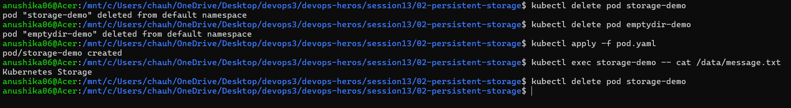

### 03 Storage Class Output
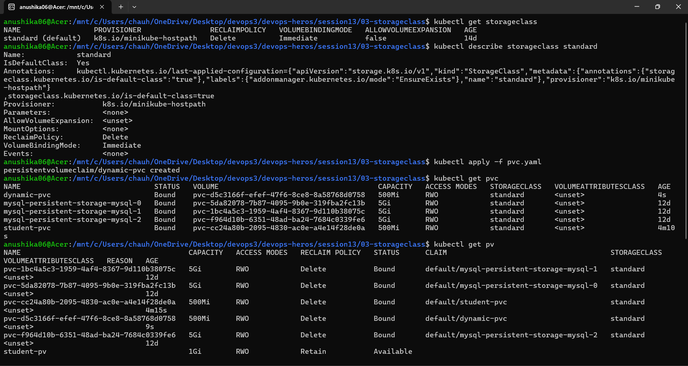
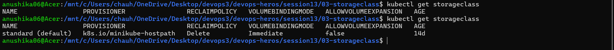

## Task 2: HPA Hands-on
- **HPA YAML**: `hpa/hpa-backend.yaml`
- **Load Generator Used**: A custom `load_generator.sh` bash script was used. It triggers a massive traffic spike by running infinite concurrent loops firing `curl` requests at the backend's `/healthz` endpoint.

### HPA Output & Scaling Observations
- **CPU Utilization**: The CPU utilization spiked well over the target (e.g., reaching 95-110% compared to a 50% target).
- **Pod Scaling**: As a result of the load, the Horizontal Pod Autoscaler triggered a scale-out event, dynamically provisioning up to 5 replicas.

### 04 HPA Output
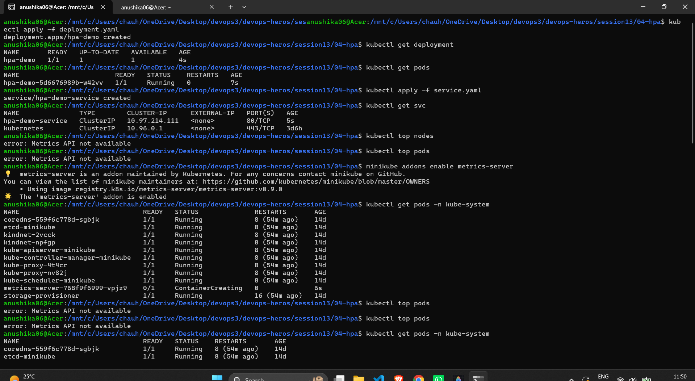
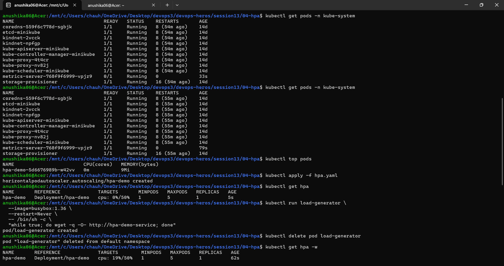
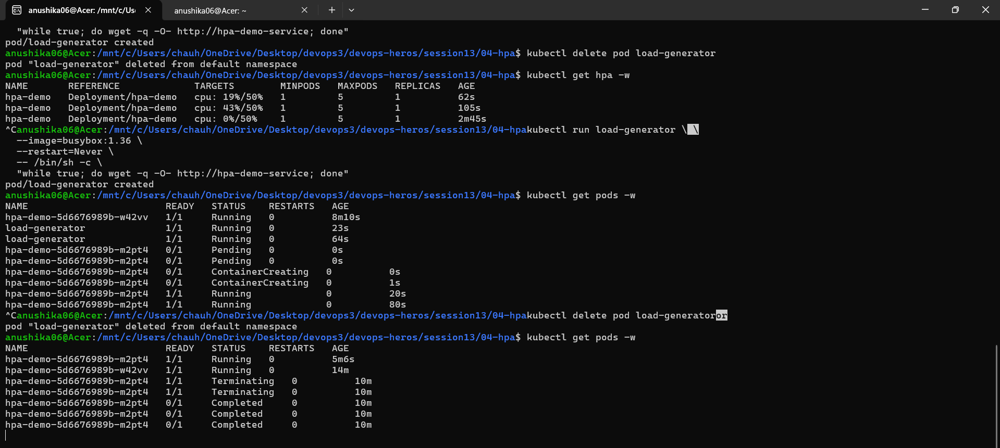
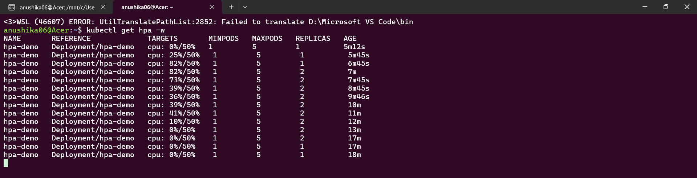

## Probes Outputs
### 05 Probes Output
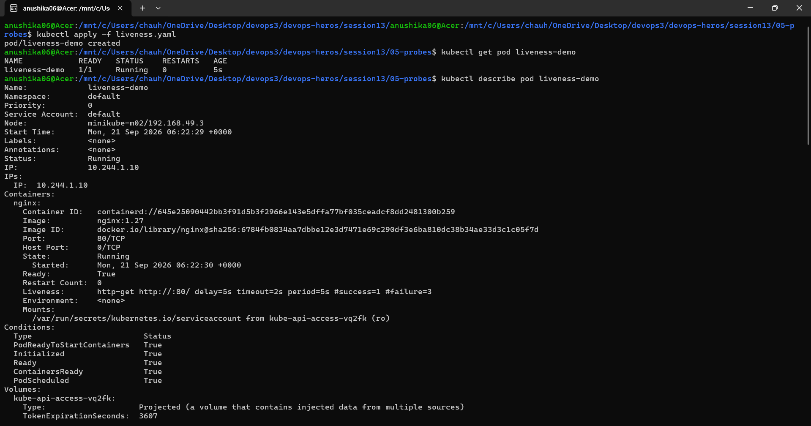
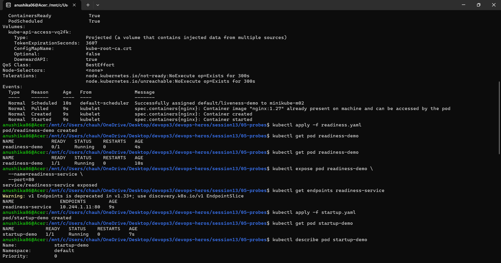
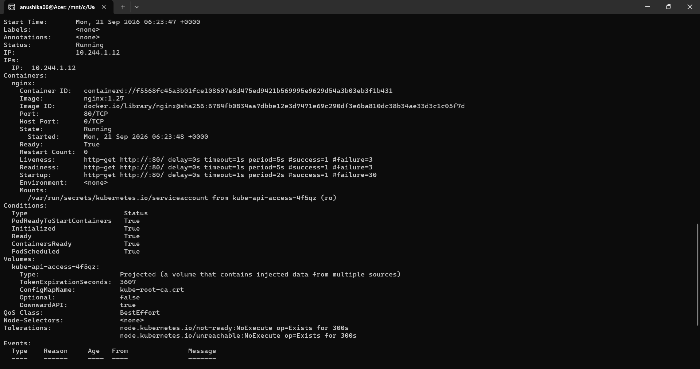
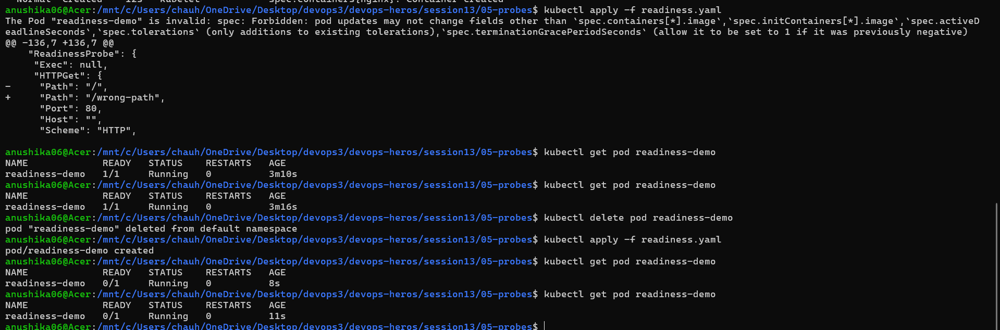
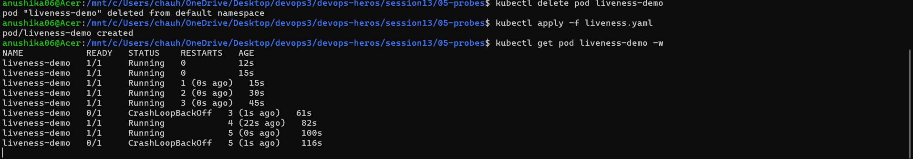
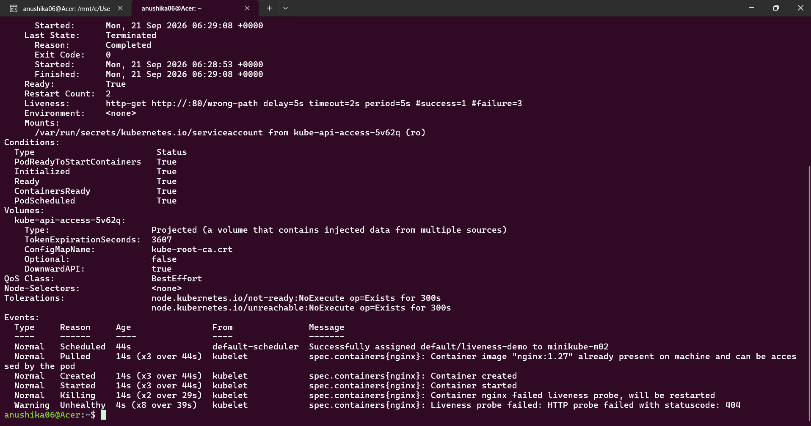

## Task 3: Mini Project
- **Volume Documentation**: Created a PersistentVolumeClaim (pvc.yaml) requesting 500Mi of ReadWriteOnce storage. This PVC is mounted to /data within our deployment, guaranteeing that data outlives Pod deletions and restarts. Verification: Proved persistence by writing a test file (student.txt) into /data on a running Pod, deleting the Pod, and verifying that the newly scheduled Pod successfully retained the file.
- **Implementation**: Successfully deployed a production-ready Web App inside a dedicated `production-webapp` namespace. The deployment combines state persistence (PVC), elastic scaling (HPA targeting 50% CPU), and full application health diagnostics (Startup, Readiness, and Liveness probes correctly configured).

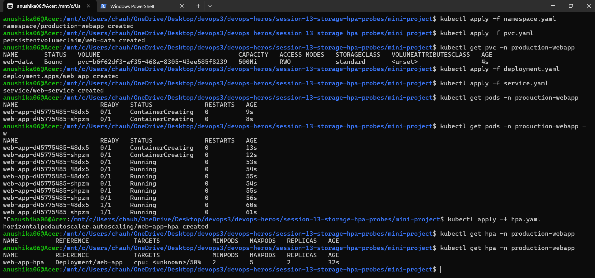
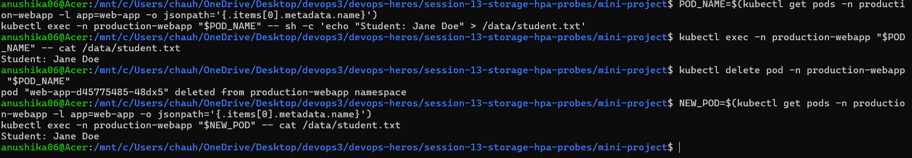
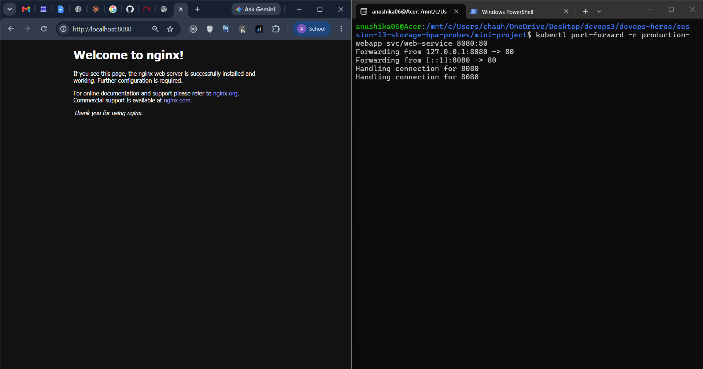