# Session 15: Helm

## Task 1: Helm Commands
Executed essential Helm commands (`create`, `install`, `list`, `status`, `upgrade`, `rollback`, `uninstall`, etc.).

### 01 What is Helm
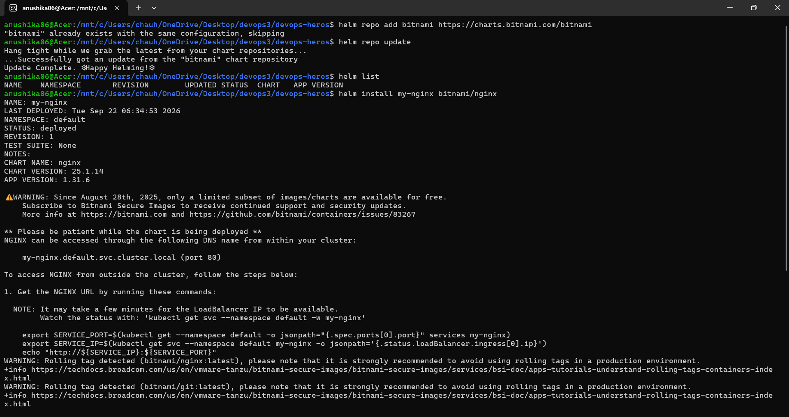
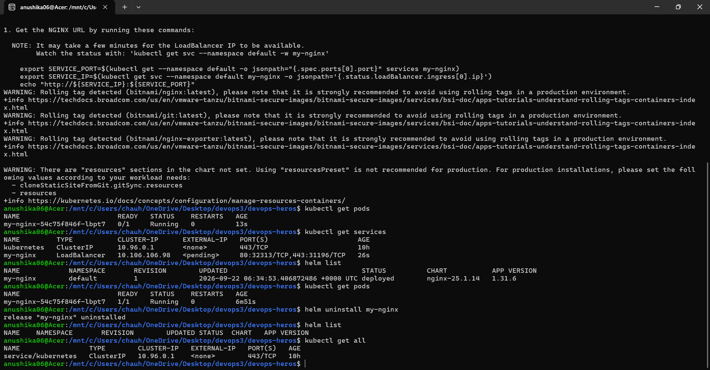

### 02 Helm Charts
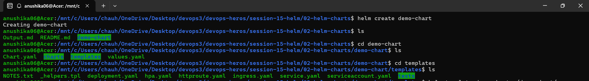
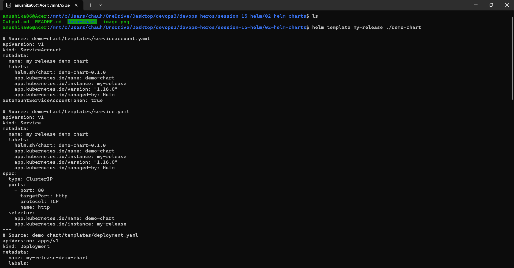
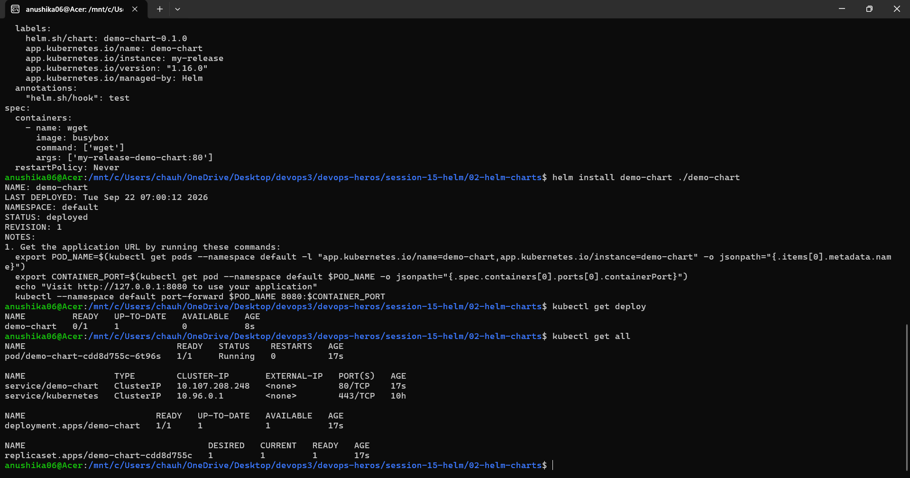

### 03 Chart Structure
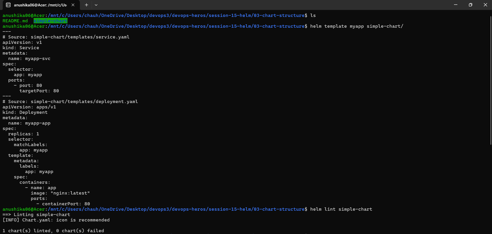
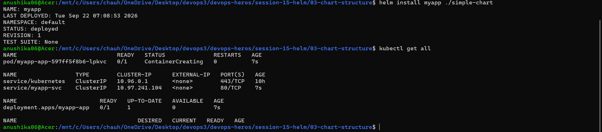

### 07 Install Upgrade
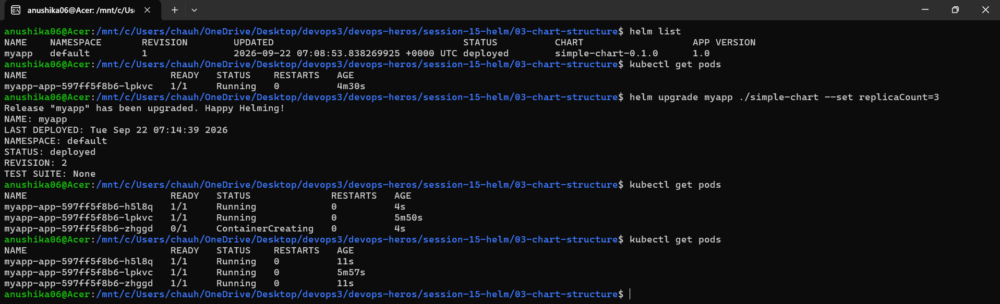
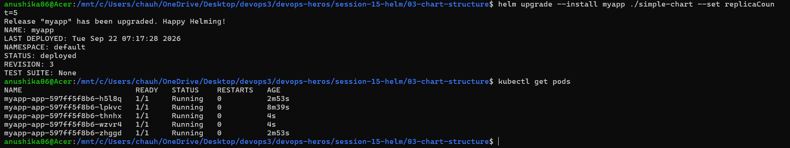
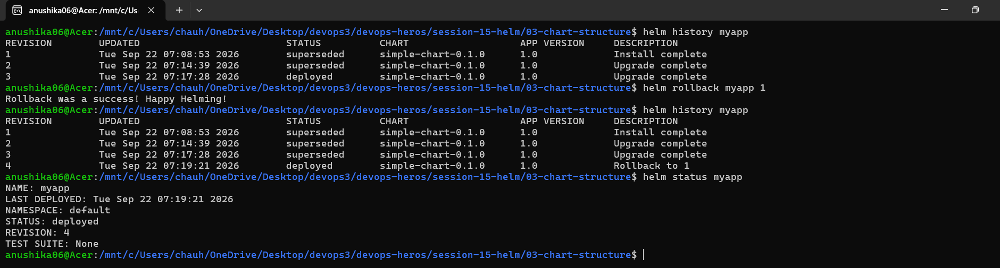

## Task 2: Helm Rollback
Successfully performed the rollback workflow:

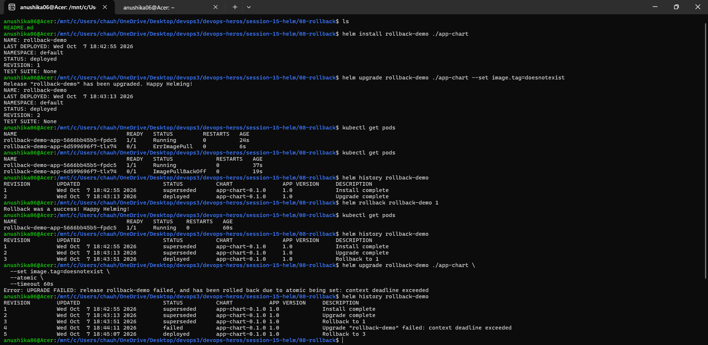

## Task 3: Mini Project
- **Helm Chart**: [notes-chart](mini-project/notes-chart)
- **values.yaml**: [values.yaml](mini-project/notes-chart/values.yaml) and [values-prod.yaml](mini-project/notes-chart/values-prod.yaml)
- **Templates**: [templates directory](mini-project/notes-chart/templates) (Deployment, Service, ConfigMap)
- **Installation & Upgrade**: Installed dev version, then successfully upgraded using `values-prod.yaml` to scale up to 3 replicas.
- **Rollback**: Simulated a bad upgrade with an invalid image tag resulting in ImagePullBackOff, then successfully performed a rollback (`helm rollback`) to a healthy state.

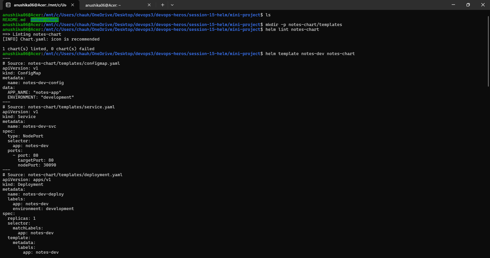
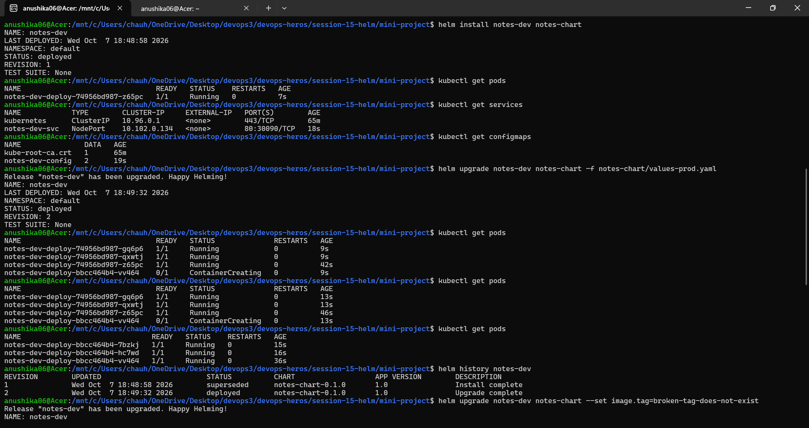
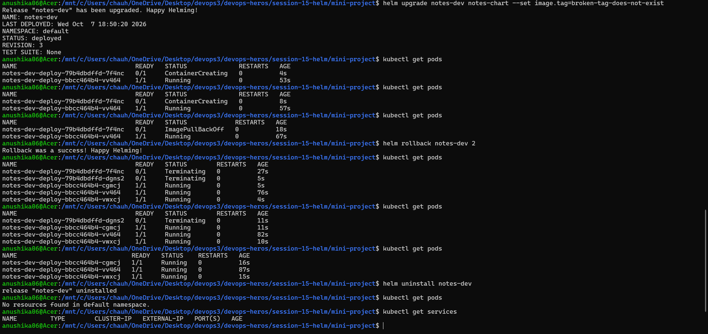