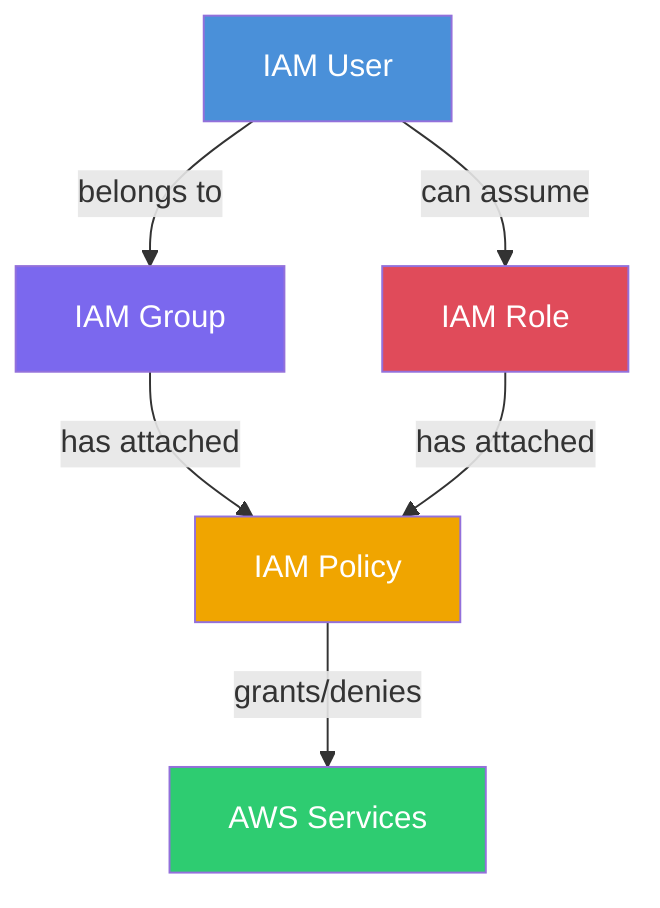
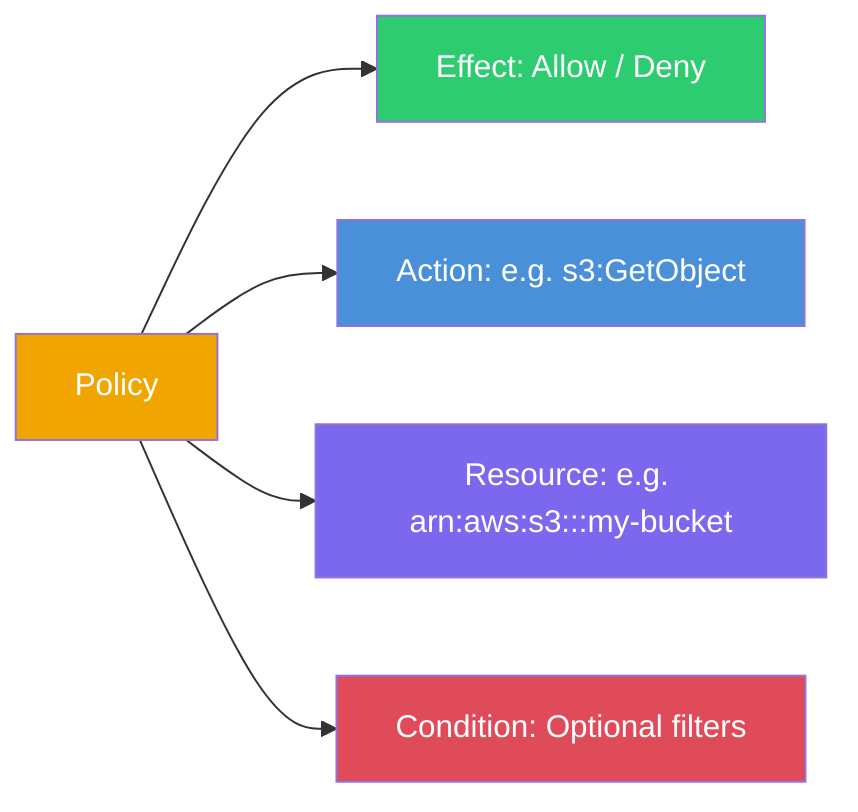

# AWS IAM (Identity and Access Management)

So, what exactly is IAM? Think of AWS Identity and Access Management (IAM) as the bouncer for your AWS account. It decides exactly who can get in and what they are allowed to do once they are inside. The best part? It's a free service that spans globally across your entire AWS environment.

---

## How IAM Fits Together

---

## The Core Components
- **Users**: These are the actual people or services that interact with AWS. If you hire a new developer, you'd create an IAM user for them.
- **Groups**: A group is simply a collection of users. Instead of giving permissions to users one by one, you can put all your developers in a "Developers" group and give the group the permissions. Much easier to manage!
- **Roles**: Roles are like temporary hats. They aren't tied to a specific person. Instead, an AWS service (like an EC2 instance) or a user can "assume" a role temporarily to get specific permissions. It's the most secure way to grant access without sharing passwords or access keys.
- **Policies**: These are JSON documents that actually define the permissions. They explicitly state "Allow this" or "Deny that".
- **Permissions**: This is the actual effect of a policy. For example, the permission to read an S3 bucket or start an EC2 instance.

---

## IAM Policy Structure

---

## Security First
A golden rule in AWS (and tech in general) is the **Principle of Least Privilege**. This means you only ever give someone the exact permissions they need to do their job, and absolutely nothing more. If a developer only needs to read from a database, don't give them admin rights just because it's easier!

## Best Practices to Keep in Mind
- Always turn on MFA (Multi-Factor Authentication) for your root account and all users.
- Never use your root account for daily tasks. Create an admin user for yourself instead.
- Rotate your access keys regularly.
- Use Roles instead of long-term access keys whenever applications need to talk to AWS services.

## Common Use Cases
- Giving an EC2 instance the ability to read images from an S3 bucket (using a Role).
- Setting up a new team member with access only to the specific servers they need to work on.
- Allowing a third-party auditing tool temporary access to check your AWS configurations.