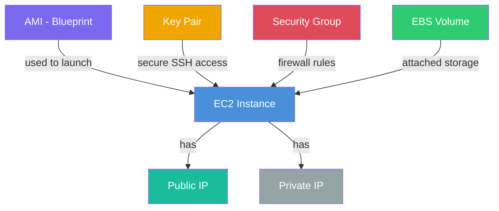
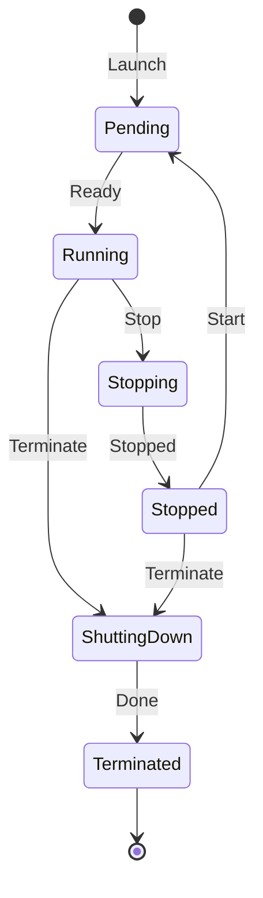

# AWS EC2 (Elastic Compute Cloud)

What is EC2? In simple terms, EC2 allows you to rent virtual computers (servers) in the cloud. Instead of buying physical hardware, plugging it into a rack, and installing an operating system, you can spin up a server in AWS in seconds, and tear it down when you're done.

---

## EC2 Instance Architecture

---

## Key Concepts
- **AMI (Amazon Machine Image)**: Think of an AMI as a blueprint or template for your server. It contains the operating system (like Ubuntu, Windows, or Amazon Linux) and any pre-installed software you want. You use an AMI to launch an instance.
- **Instance Types**: Servers come in different shapes and sizes. Some have lots of CPU for heavy processing, others have massive amounts of RAM for in-memory databases. You pick the instance type that matches your workload.
- **Key Pairs**: To securely log into your instance (especially Linux servers via SSH), AWS uses public key cryptography. You keep the private key on your laptop, and AWS puts the public key on the server.
- **Security Groups**: This is essentially a virtual firewall attached directly to your EC2 instance. You configure rules to say things like "Only allow web traffic on port 80" or "Only allow SSH from my specific IP address".
- **EBS (Elastic Block Store)**: If EC2 is the brain and CPU, EBS is the hard drive. It's network-attached storage that you attach to your EC2 instance to store your files and databases.

---

## Instance Lifecycle

---

## IP Addresses
- **Public IP**: An address that can be reached from anywhere on the internet.
- **Private IP**: An address that is only reachable from inside your AWS network (VPC).

## Common Use Cases
- Hosting web servers or applications.
- Running background processing jobs or batch scripts.
- Hosting databases (though RDS is often better for this if you want it managed).