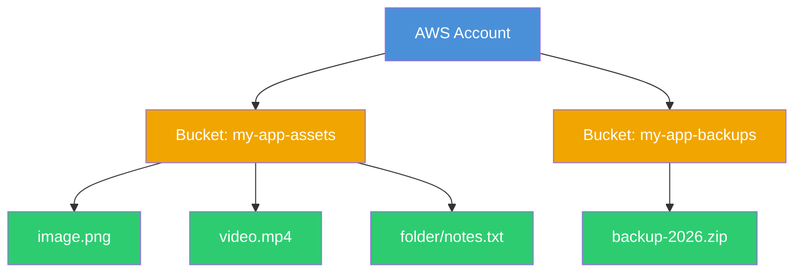
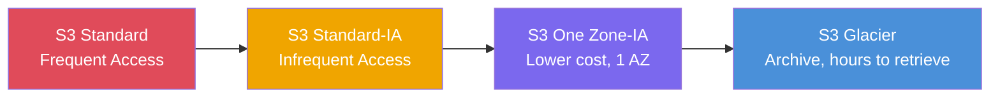

# AWS S3 (Simple Storage Service)

What is S3? It is an incredibly popular object storage service. You don't use it like a traditional hard drive (you can't install an operating system on it); instead, you use it to store "objects" like images, videos, backups, and documents. It offers basically infinite storage capacity.

---

## S3 Structure

---

## Storage Classes Comparison

---

## Features that Make S3 Great
- **Buckets**: A bucket is just the top-level container (like a main folder) where you store your files. Bucket names have to be globally unique across all of AWS!
- **Objects**: These are the actual files you upload. Every object consists of the data itself and some metadata (like when it was uploaded).
- **Storage Classes**: Not all data is accessed frequently. S3 offers different tiers to save money.
- **Versioning**: If you turn this on, S3 keeps every version of a file you upload. If you accidentally delete or overwrite a file, you can easily restore the older version. It's a lifesaver.
- **Lifecycle Policies**: Automate your storage costs by automatically transitioning objects to cheaper storage tiers.
- **Encryption**: Ensures your data is encrypted at rest and in transit.
- **Bucket Policies**: JSON policies attached directly to the bucket to allow/deny access.

---

## Lifecycle Policy Flow

---

## Common Use Cases
- Storing static website assets (images, CSS, JS). You can even host an entire static website directly from S3!
- Storing application backups, database dumps, and log files.
- Acting as a massive data lake for big data analytics and machine learning.