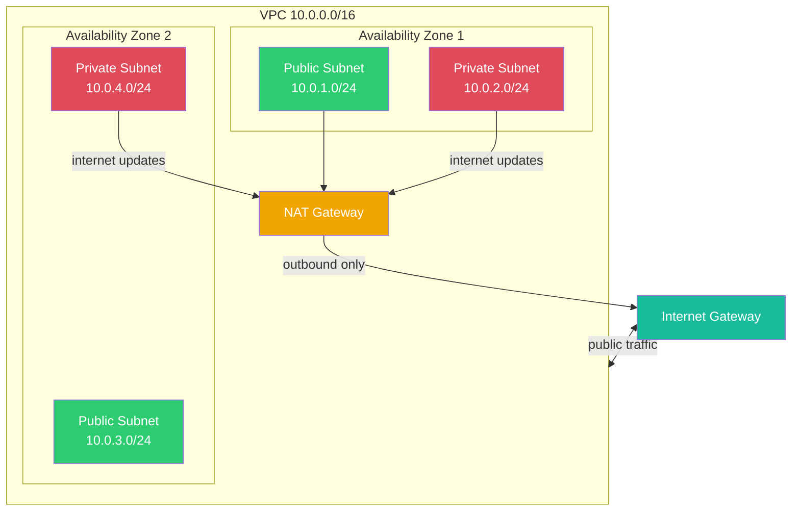
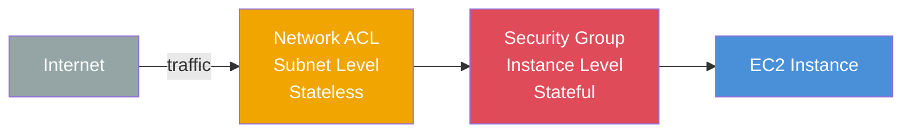

# AWS VPC (Virtual Private Cloud)

What is VPC? A VPC is your own private slice of the AWS cloud. It's a virtual network that closely resembles a traditional network you'd operate in your own data center, but it's completely software-defined. Everything you launch (like EC2 instances or RDS databases) lives inside a VPC.

---

## VPC Architecture

---

## Networking Basics
- **CIDR (Classless Inter-Domain Routing)**: A way to define a block of IP addresses for your network (like `10.0.0.0/16`, giving you 65,000+ IPs).
- **Subnets**: You chop your VPC's CIDR block into smaller chunks. Each subnet lives in one specific Availability Zone.
- **Public vs Private Subnet**: A subnet is "public" if it has a direct route to the internet. You usually put load balancers in public subnets and databases in private subnets.

---

## Security Groups vs NACLs

---

## How Traffic Moves
- **Internet Gateway (IGW)**: The door to the internet for your VPC.
- **Route Tables**: Act like a GPS for your network traffic, dictating where traffic is directed.
- **NAT Gateway**: Allows private subnet resources to reach the internet for outbound traffic (like updates), while blocking inbound connections from the internet.

## Security
- **Security Groups**: Stateful firewall at the **instance** level. Allow a request in, and the response is automatically allowed out.
- **Network ACLs (NACLs)**: Stateless firewall at the **subnet** level. You must explicitly allow traffic both in and out.