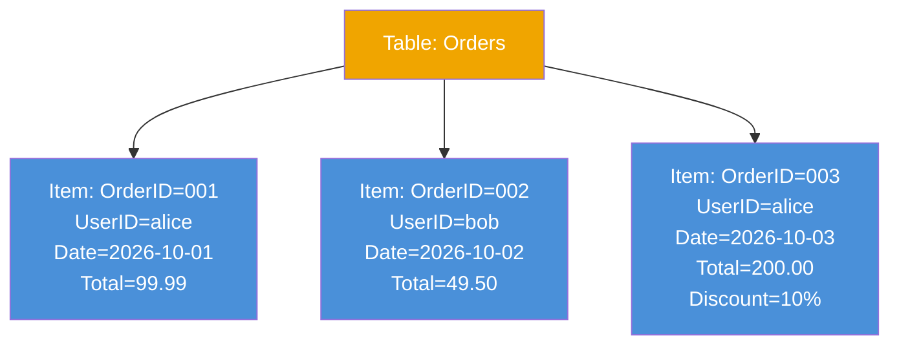
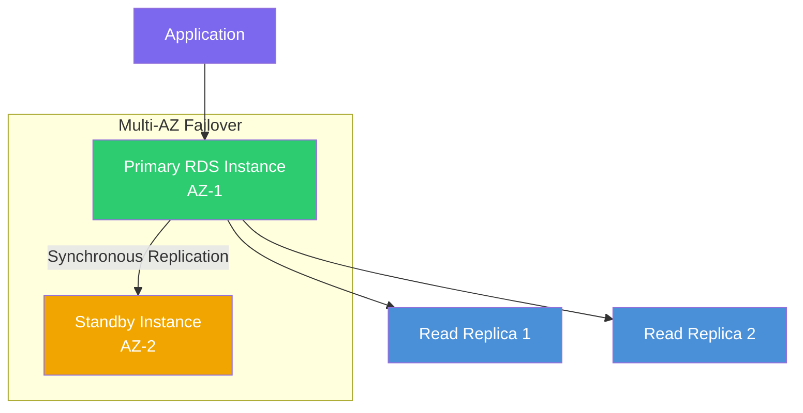

# AWS Database Services: DynamoDB & RDS

AWS offers many database options, but two of the most popular are DynamoDB (NoSQL) and RDS (Relational).

---

## Amazon DynamoDB

DynamoDB is AWS's flagship **NoSQL** database. It is fully managed, serverless, and ridiculously fast (single-digit millisecond performance at any scale).

### DynamoDB Data Model

> Notice how Item 3 has an extra `Discount` attribute — in DynamoDB, items in the same table don't need to have the same schema!

### Key Concepts
- **Tables, Items, and Attributes**: Tables contain **Items** (like rows). Each item has **Attributes** (like columns). Attributes are flexible per item.
- **Partition Key**: A unique key that DynamoDB uses to distribute data across its storage (e.g., `UserID`).
- **Sort Key**: Combined with the Partition Key, this lets you query a range of items (e.g., `UserID` + `OrderDate` = all orders for a user sorted by date).

### Common Use Cases
- High-traffic web apps, gaming leaderboards, and shopping carts where you need lightning-fast reads and writes without managing servers.

---

## Amazon RDS (Relational Database Service)

If your app requires complex queries, joins, and rigid schemas, you need a **Relational Database**. RDS makes it easy to set up, operate, and scale a relational database in the cloud.

### RDS High Availability with Multi-AZ

### Key Features
- **Supported Engines**: MySQL, PostgreSQL, MariaDB, Oracle, and Microsoft SQL Server.
- **DB Instances**: EC2 servers optimized for databases that AWS manages for you (OS patches, installations, etc.).
- **Security**: Control access using VPCs and Security Groups. Easily encrypt your database at rest.
- **Backups**: RDS takes automated daily backups and lets you snapshot on-demand.
- **Multi-AZ**: Synchronously replicates your database to a standby instance in a different AZ. Auto-failover if primary fails.
- **Read Replicas**: Spin up replicas to handle heavy read traffic, taking load off your main database.

### Common Use Cases
- Traditional web apps (WordPress, Django), ERPs, CRMs, and anywhere you need strong data consistency and complex SQL queries.

---

## DynamoDB vs RDS at a Glance

| Feature | DynamoDB | RDS |
|---|---|---|
| **Type** | NoSQL | Relational (SQL) |
| **Schema** | Flexible | Fixed |
| **Scaling** | Automatic | Manual / Auto Scaling |
| **Queries** | Key-based | Complex SQL joins |
| **Best For** | High-speed, high-scale apps | Structured, relational data |
| **Management** | Fully serverless | Managed (but you pick instance size) |