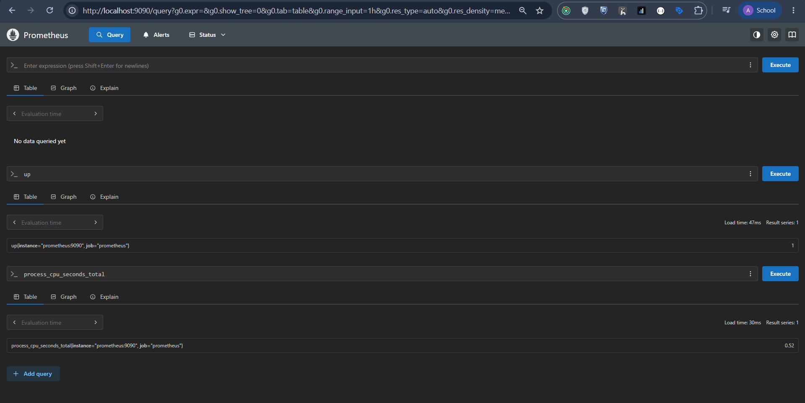
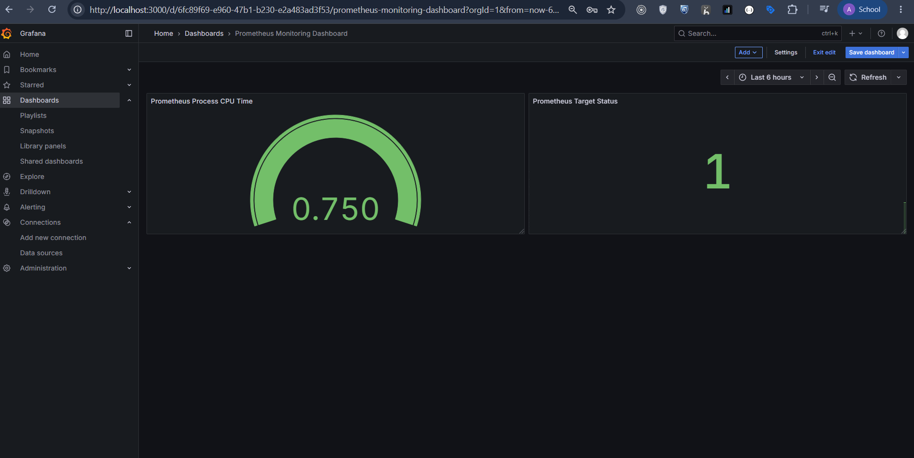
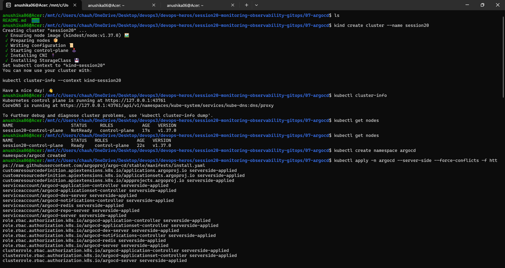
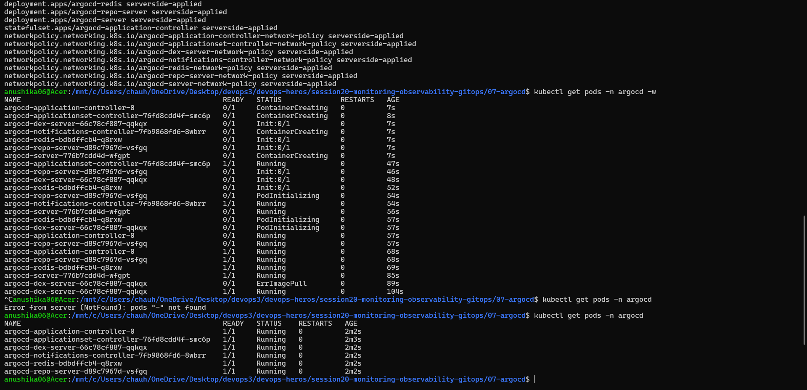
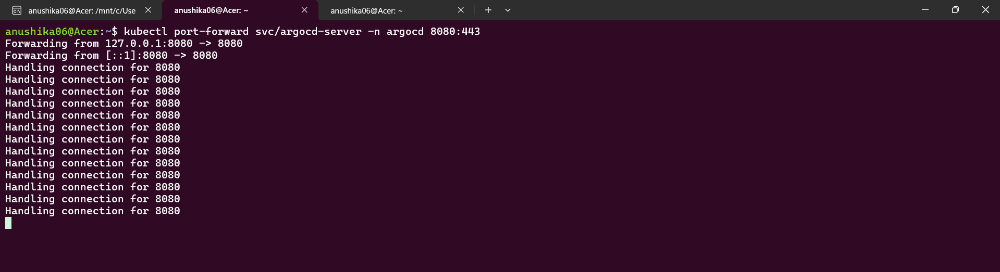
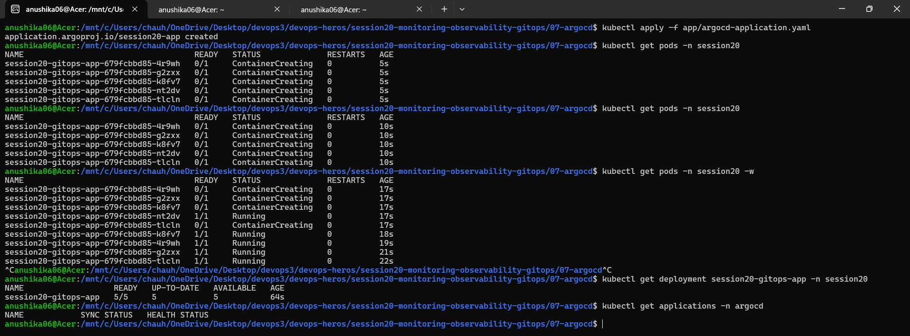
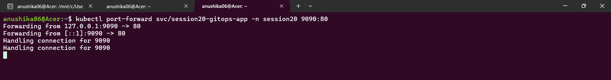
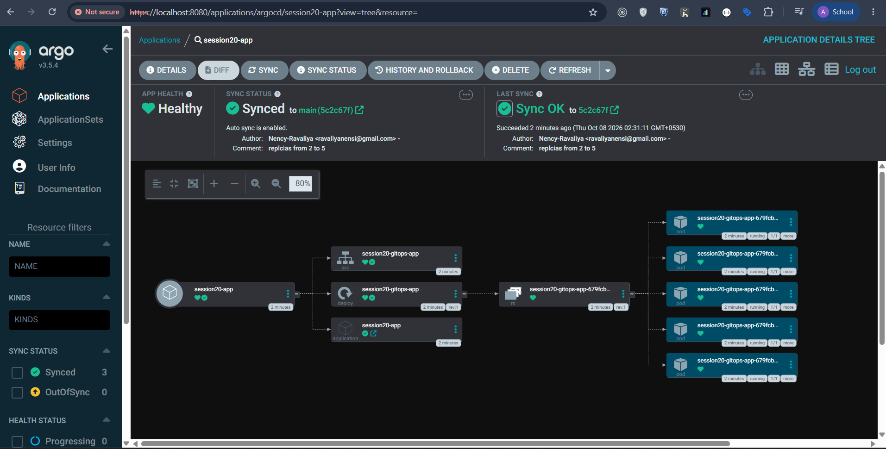
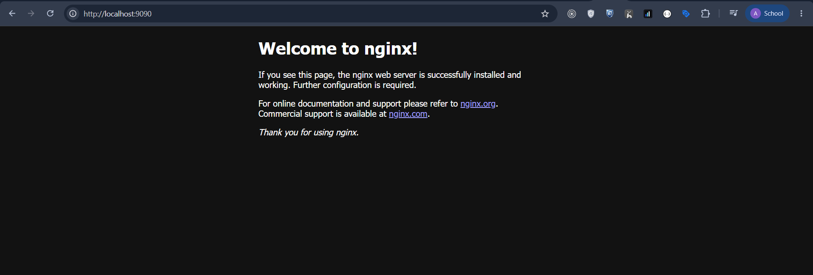

# Session 20: Monitoring, Observability & GitOps

---

## Task 1: Monitoring

- **Metrics**: Numerical measurements collected over time — things like CPU usage %, memory usage %, request count, and error rate. These tell you how your system is performing right now.
- **Logs**: Timestamped records of events that happened inside your application or infrastructure. When something breaks, logs are usually where you find the "why".
- **Alerts**: Rules that automatically notify you (via email, Slack, etc.) when a metric crosses a threshold — for example, "alert me if CPU goes above 80% for 5 minutes".
- **CPU Utilization**: Tracked how much processing power the application pods were consuming. Spikes usually indicate high traffic or runaway processes.
- **Memory Utilization**: Tracked RAM usage. Memory leaks often show up as a gradual, never-ending increase in this metric.
- **Application Health**: Used liveness and readiness probes in Kubernetes to know if pods were healthy and ready to serve traffic.

### Monitoring Demo



---

## Task 2: Observability

### Metrics
Numerical time-series data. Aggregated, lightweight, and great for dashboards and alerts. Example: "How many HTTP requests per second is my app handling?" Tools like Prometheus scrape and store these.

### Logs
Detailed, plain-text records of everything that happens inside your application. Incredibly useful for post-incident investigation. Tools like Loki or the ELK Stack aggregate and search logs.

### Traces
Follow a single request as it flows through your entire system — from the user's browser, through the load balancer, to the backend, to the database. Essential for debugging performance issues in microservices. Tools like Jaeger or Zipkin handle distributed tracing.

### Why Observability is Required
In a modern Kubernetes environment, a single user request might touch many different services. Without observability you're debugging in the dark — you can't tell *where* or *why* something failed. It reduces MTTR (Mean Time To Recovery) and builds confidence when deploying new changes.

### Common Tools

| Tool | Purpose | Pillar |
|---|---|---|
| Prometheus | Metrics collection & alerting | Metrics |
| Grafana | Dashboards & visualization | Metrics |
| Loki | Log aggregation | Logs |
| Jaeger / Zipkin | Distributed tracing | Traces |
| OpenTelemetry | Unified instrumentation SDK | All three |

### Kubernetes Observability
Kubernetes exposes metrics out of the box via the Metrics Server. You can query pod-level CPU/memory with `kubectl top pods`. Grafana dashboards display cluster-wide health, and alerts fire when pods are repeatedly crashing or nodes are running out of memory.



---

## Task 3: GitOps

### What is GitOps?
GitOps is a way of operating Kubernetes where **Git is the single source of truth** for the entire system's desired state. Instead of running `kubectl apply` manually, you define everything in Git and a GitOps tool automatically keeps the live cluster in sync with the repo.

### Git as the Source of Truth
Your Git repository holds the entire desired state of your cluster — deployments, services, config maps, etc. If the cluster drifts from what's in Git, the GitOps tool detects the drift and corrects it automatically.

### Declarative Configuration
Instead of writing scripts that say *how* to do something, you write YAML files that say *what* you want ("I want 3 replicas of this pod running"). Kubernetes figures out how to get there.

### Continuous Reconciliation
A GitOps agent (like ArgoCD) runs inside the cluster and continuously compares its live state against the desired state in Git. If they drift apart, it reconciles them back to match Git. This loop runs constantly.

### GitOps Workflow

```
Developer pushes code
        |
        v
CI Pipeline runs (build, test, push image)
        |
        v
CI updates the Kubernetes manifest in Git (new image tag)
        |
        v
ArgoCD detects the change in Git
        |
        v
ArgoCD applies the updated manifest to the cluster
        |
        v
Cluster state matches Git - deployment complete
```

### Kubernetes + GitOps
We used **ArgoCD** as the GitOps controller. ArgoCD watches a Git repository and automatically syncs changes to the Kubernetes cluster. If you delete a resource manually, ArgoCD recreates it within seconds because Git says it should exist.








