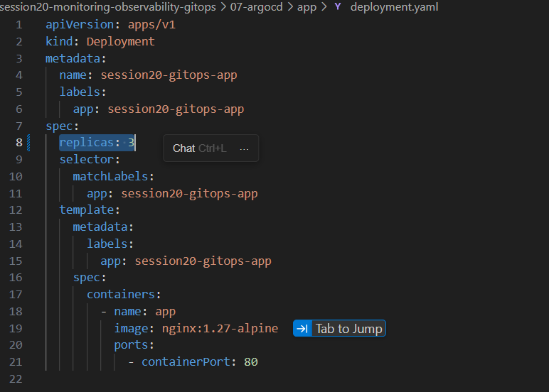

# Session 20: Monitoring, Observability & GitOps

---

## Task 1: Monitoring

Monitoring is about watching your systems in real time and getting notified when something goes wrong. Think of it as setting up a dashboard for your car — you want to know the speed, fuel level, and temperature at all times, not after the engine breaks down.

### What We Monitored

- **Metrics**: Numerical measurements collected over time — things like CPU usage %, memory usage %, request count, and error rate. These are the numbers that tell you how your system is performing.
- **Logs**: Timestamped records of events that happened inside your application or infrastructure. When something breaks, logs are usually where you find the "why".
- **Alerts**: Rules you set up to automatically notify you (via email, Slack, etc.) when a metric crosses a threshold — for example, "alert me if CPU goes above 80% for 5 minutes".

### What We Observed

- **CPU Utilization**: Tracked how much processing power the application pods were consuming. Spikes usually indicate high traffic or runaway processes.
- **Memory Utilization**: Tracked RAM usage. Memory leaks often show up as a gradual, never-ending increase in this metric.
- **Application Health**: Used liveness and readiness probes (already set up in Kubernetes) to know if pods were healthy and ready to serve traffic.

### Monitoring Demo


---

## Task 2: Observability

While monitoring tells you *that* something is wrong, observability helps you understand *why* it is wrong. An observable system gives you enough data to investigate and answer questions you didn't even think to ask beforehand.

### The Three Pillars of Observability

**1. Metrics**
Metrics are numerical time-series data. They are aggregated, lightweight, and great for dashboards and alerts. Example: "How many HTTP requests per second is my app handling?" or "What is my pod's CPU usage over the last hour?". Tools like Prometheus scrape and store these metrics.

**2. Logs**
Logs are the detailed, plain-text records of everything that happens inside your application. They are incredibly useful for post-incident investigation. Example: seeing a `NullPointerException` in your app logs that explains why a pod crashed. Tools like Loki or the ELK Stack (Elasticsearch, Logstash, Kibana) help aggregate and search logs.

**3. Traces**
Traces follow a single request as it flows through your entire system — from the user's browser, through your load balancer, to your backend service, to your database. They are essential for debugging performance issues in microservices. Example: identifying that 95% of a request's latency is caused by a slow database query. Tools like Jaeger or Zipkin handle distributed tracing.

### Why Observability is Required

In a modern Kubernetes environment with many microservices, a single user request might touch 10 different services. When something goes wrong, you need to know *exactly* where it failed and why. Without observability, you're essentially debugging in the dark. It reduces MTTR (Mean Time To Recovery), helps you understand system behaviour under load, and builds confidence when deploying new changes.

### Common Tools

| Tool | Purpose | Pillar |
|---|---|---|
| Prometheus | Metrics collection & alerting | Metrics |
| Grafana | Dashboards & visualization | Metrics |
| Loki | Log aggregation | Logs |
| Jaeger / Zipkin | Distributed tracing | Traces |
| OpenTelemetry | Unified instrumentation SDK | All three |

### Kubernetes Observability

Kubernetes exposes a rich set of metrics out of the box via the Metrics Server. You can query pod-level CPU/memory with `kubectl top pods`. Grafana dashboards can be set up to display cluster-wide health, and alerts can fire when pods are repeatedly crashing (CrashLoopBackOff) or when nodes are running out of memory.


---

## Task 3: GitOps

GitOps is a way of operating Kubernetes (and infrastructure in general) where **Git is the single source of truth** for your entire system's desired state. Instead of running `kubectl apply` manually, you define everything in Git, and a GitOps tool automatically makes your live cluster match what's in the repo.

### What is GitOps?

The core idea is simple: if you want to change something in your Kubernetes cluster, you open a Pull Request. Once it's merged, the change is automatically applied. No manual `kubectl` commands, no SSH-ing into servers. Everything is version controlled, auditable, and reversible.

### Key Concepts

**Git as the Source of Truth**
Your Git repository holds the entire desired state of your cluster — deployments, services, config maps, secrets, etc. If the cluster somehow drifts from what's in Git (maybe someone made a manual change), the GitOps tool detects the drift and corrects it automatically.

**Declarative Configuration**
Instead of writing scripts that say *how* to do something ("run this command, then that command"), you write YAML files that say *what* you want ("I want 3 replicas of this pod running"). Kubernetes (and tools like ArgoCD) figure out how to get there.

**Continuous Reconciliation**
A GitOps agent (like ArgoCD) runs inside your cluster and continuously compares the live state of the cluster against the desired state in Git. If they drift apart, it reconciles them — pulling the cluster back to match Git. This loop runs constantly, ensuring consistency.

### GitOps Workflow

```
Developer pushes code
        |
        v
CI Pipeline runs (build, test, push image)
        |
        v
CI updates the Kubernetes manifest in Git (new image tag)
        |
        v
ArgoCD detects the change in Git
        |
        v
ArgoCD applies the updated manifest to the cluster
        |
        v
Cluster state matches Git - deployment complete
```

### Kubernetes + GitOps

We used **ArgoCD** as the GitOps controller. ArgoCD watches a Git repository and automatically syncs changes to the Kubernetes cluster. If you delete a resource manually from the cluster, ArgoCD will recreate it within seconds because Git says it should exist. This makes your deployments reliable, repeatable, and fully automated.



---

## Deliverables Summary

| Task | Status | Evidence |
|---|---|---|
| Monitoring Demo | Done | Screenshots above (Task 1) |
| Observability Documentation | Done | Documented in Task 2 |
| GitOps Demo (ArgoCD) | Done | Screenshots above (Task 3) |
| README.md | Done | This file |
