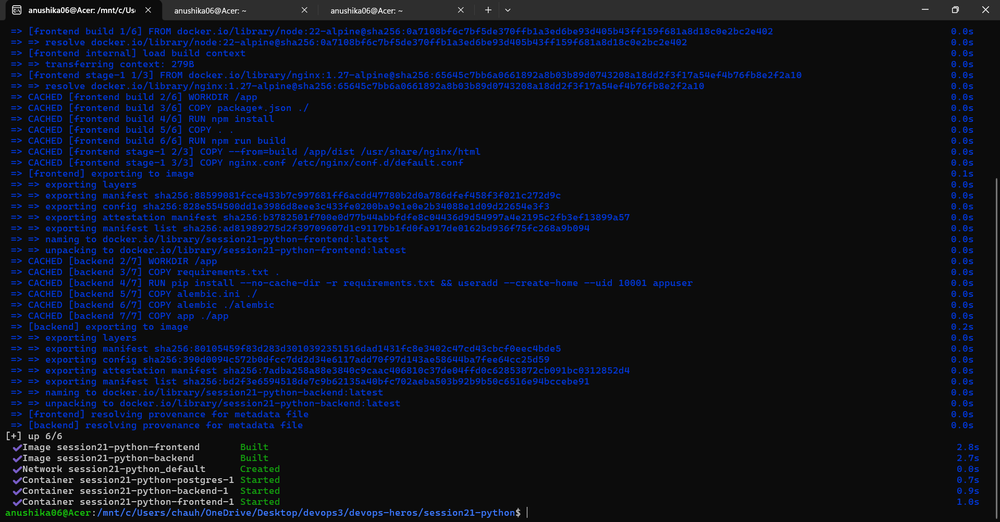
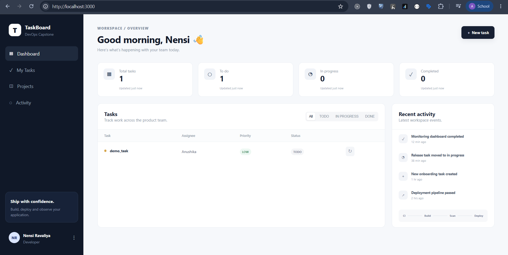
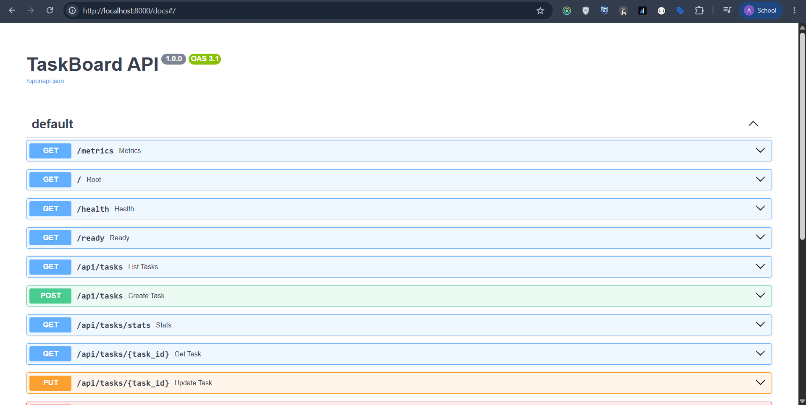
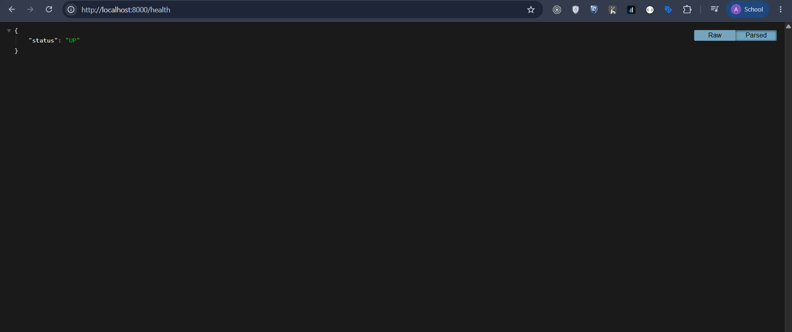
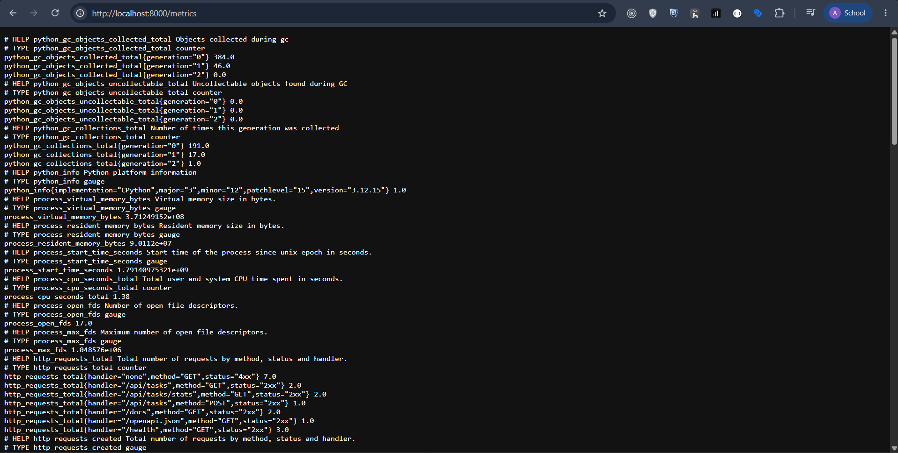

# Session 21 — DevOps Final Capstone: TaskBoard (Python)

## 1. What We Are Building

TaskBoard is a small but realistic SaaS-style project management application built using the following technologies:

- React + Vite frontend
- Responsive HTML/JSX + CSS UI
- FastAPI Python backend
- PostgreSQL database
- SQLAlchemy ORM
- Alembic database migrations
- REST APIs
- Pytest automated tests
- Docker containers
- GitHub Actions CI/CD
- Trivy container security scanning
- GitHub Container Registry
- Terraform for AWS infrastructure
- AWS VPC + EKS
- Kubernetes
- Helm
- Ingress
- HPA
- Prometheus + Grafana
- Health/readiness endpoints
- Troubleshooting exercises

The point is not to teach isolated tools. The point is to show how a real application travels from a developer laptop to a monitored Kubernetes environment.

```text
Developer
   |
   v
Git / GitHub
   |
   v
GitHub Actions
   |-- pytest
   |-- frontend build
   |-- Docker build
   |-- Trivy scan
   `-- push images to GHCR
              |
              v
        Terraform
              |
       AWS VPC + EKS
              |
              v
            Helm
              |
      +-------+--------+
      |                |
   Frontend          Backend
    React            FastAPI
      |                |
      +-------> PostgreSQL
              |
       Prometheus
              |
           Grafana
```

---

## 2. Repository Structure

```text
session21-devops-capstone-final/
├── frontend/                 # React application and CSS
├── backend/                  # FastAPI application
│   ├── app/                  # API, models, schemas, DB config
│   ├── tests/                # Pytest tests
│   └── alembic/              # DB migrations
├── docker-compose.yml        # Full local stack
├── terraform/                # AWS VPC + EKS infrastructure
├── helm/taskboard/           # Kubernetes package
├── k8s/                      # namespace/bootstrap manifests
├── monitoring/               # Prometheus/Grafana values
├── troubleshooting/          # deliberately broken manifests
├── scripts/                  # load-test helpers
└── .github/workflows/        # CI/CD
```

---

## 3. Frontend

The frontend is intentionally closer to a real SaaS dashboard than a tutorial CRUD page. It contains:

- Dark sidebar
- Workspace navigation
- Dashboard header
- KPI cards
- Task table with status filters and priority badges
- Activity feed
- Pipeline indicator
- Create-task modal
- Responsive CSS
- Loading and backend-error states

The browser calls `/api/tasks` and `/api/tasks/stats`. Nginx and Kubernetes Ingress handle routing — the browser does not need to know the internal backend hostname.

---

## 4. Backend

FastAPI exposes the following endpoints:

```text
GET    /
GET    /health
GET    /ready
GET    /metrics

GET    /api/tasks
GET    /api/tasks/{id}
POST   /api/tasks
PUT    /api/tasks/{id}
DELETE /api/tasks/{id}
GET    /api/tasks/stats
```

Swagger documentation is available at `/docs` when the backend is running.

### Why `/health`?
A container can be alive while its application is unhealthy. `/health` gives Kubernetes a cheap liveness check.

### Why `/ready`?
Readiness answers a different question: **can this application serve traffic now?** The endpoint verifies database access before returning READY.

### Why `/metrics`?
Prometheus needs machine-readable metrics. The FastAPI Prometheus instrumentator exposes request metrics for monitoring.

---

## 5. Screenshots





